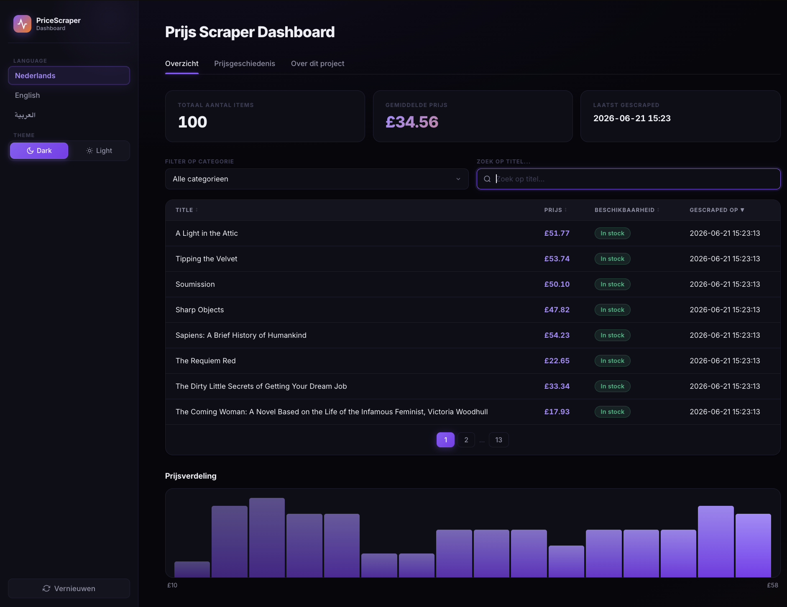
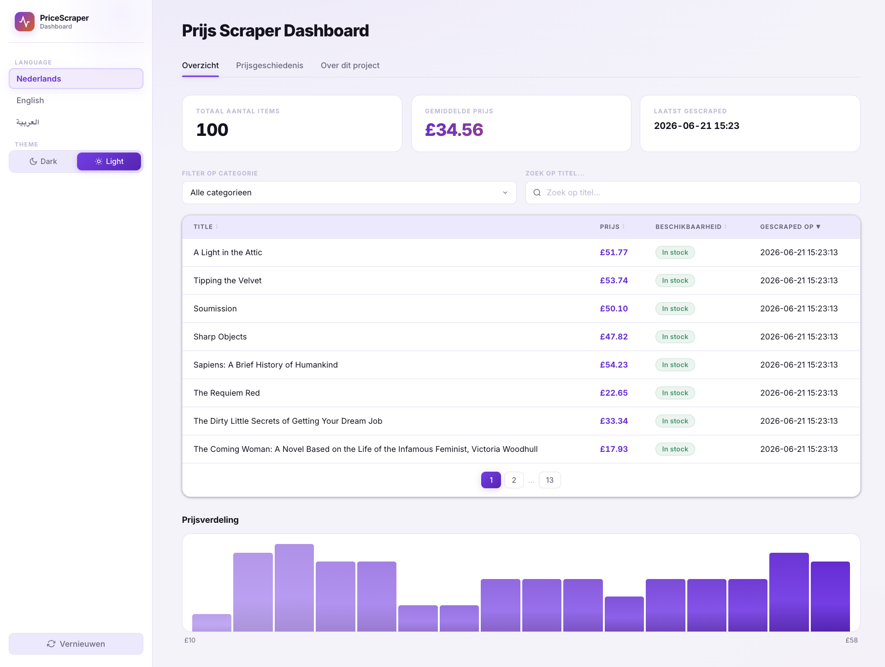

# 📊 Price Scraper Dashboard

Een leerproject: een Python web scraper die boekendata verzamelt van
[books.toscrape.com](https://books.toscrape.com) (een legale oefen-site voor scraping),
opslaat in een SQLite database, en visualiseert in een interactief, volledig custom
HTML/CSS/JS dashboard — met dark/light mode en NL/EN/AR taalondersteuning.

> 🇳🇱 Nederlands | 🇬🇧 [English](#-price-scraper-dashboard-en) | 🇸🇦 [العربية](#-لوحة-تحكم-سحب-الأسعار-ar)


## 📸 Screenshots

| Dark mode | Light mode |
|---|---|
|  |  |

---

## ✨ Features

- 🕷️ **Web scraper** (`requests` + `BeautifulSoup`) met paginatie en beleefde delays
- 🗄️ **SQLite database** voor persistente opslag, inclusief historische data
- 📈 **Volledig custom dashboard** (HTML/CSS/JS): sorteerbare tabel, paginering, filters, zoeken, grafieken
- 🌓 **Dark & light mode**, direct te wisselen in de sidebar
- 🌐 **Meertalig** (NL / EN / AR) met automatische RTL-layout voor Arabisch
- 🐳 **Docker-ready** — start met één commando, geen lokale Python-installatie nodig
- ⏰ **Optionele scheduler** om automatisch periodiek te scrapen
- 🧩 **Uitbreidbare architectuur** — voeg makkelijk een nieuwe scraper toe (vacatures, nieuws, etc.)

## 📁 Projectstructuur

```
price-scraper-dashboard/
├── main.py                  # Entry point: runt de scraper
├── requirements.txt
├── Dockerfile
├── docker-compose.yml
├── docker-entrypoint.sh
├── scraper/
│   ├── scraper.py            # Scraping logica (books.toscrape.com)
│   └── database.py           # SQLite database laag
├── dashboard/
│   ├── app.py                 # Streamlit shell (laadt data, leest taal uit URL)
│   ├── dashboard_app.py        # Het volledige dashboard: custom HTML/CSS/JS component
│   └── i18n.py                 # Vertaal-helper
├── locales/
│   ├── nl.json
│   ├── en.json
│   └── ar.json
├── screenshots/
│   ├── overview-dark.png
│   └── overview-light.png
└── data/
    └── scraper.db             # Wordt automatisch aangemaakt
```

## 🐳 Snelste start: Docker

```bash
git clone https://github.com/yahyahani/price-scraper-dashboard.git
cd price-scraper-dashboard
docker compose up --build
```

Wacht tot je in de terminal `Dashboard starten op http://localhost:8501` ziet, en open dan:

👉 **[http://localhost:8501](http://localhost:8501)**

De eerste keer scraapt de container automatisch boekendata voordat het dashboard opent.
Je database (`data/scraper.db`) blijft bewaard tussen herstarts.

Stoppen:
```bash
docker compose down
```

## 🛠️ Alternatief: lokaal draaien zonder Docker

```bash
git clone https://github.com/yahyahani/price-scraper-dashboard.git
cd price-scraper-dashboard

python3 -m venv venv
source venv/bin/activate          # Windows: venv\Scripts\activate

pip install -r requirements.txt

python main.py                    # scraper eenmalig draaien
streamlit run dashboard/app.py    # dashboard starten
```

> **Let op (macOS / Apple Silicon):** gebruik Python 3.12, niet 3.13/3.14 — nieuwere versies
> kunnen segfaults geven met `pandas`/`numpy` doordat die nog geen volwassen wheels hebben.
> ```bash
> brew install python@3.12
> /opt/homebrew/opt/python@3.12/bin/python3.12 -m venv venv
> ```

### Automatisch periodiek scrapen

```bash
python main.py --schedule --interval 6   # elke 6 uur
```

## 🎨 Dark & light mode

Het dashboard is volledig custom gebouwd (HTML/CSS/JS in plaats van Streamlit's eigen
widgets) voor een modern, premium ontwerp. Wissel direct tussen dark en light via de
schakelaar in de sidebar.

## 🧩 Een nieuwe scraper toevoegen

Dit project is gemaakt om uit te breiden naar andere databronnen (bv. vacatures of nieuws):

1. Maak een nieuw bestand, bv. `scraper/jobs_scraper.py`
2. Schrijf een functie die een lijst van `dict`s teruggeeft met de keys:
   `source, category, title, price, currency, availability, url`
   (gebruik `None` voor velden die niet van toepassing zijn, bv. `price` bij vacatures)
3. Importeer en roep die functie aan in `main.py`
4. Klaar — het dashboard en de database werken automatisch met de nieuwe data

## 🛠️ Gebruikte technologieën

| Onderdeel | Technologie |
|---|---|
| Scraping | `requests`, `BeautifulSoup4` |
| Database | `sqlite3` (Python standaardbibliotheek) |
| Dashboard | `Streamlit` (shell) + custom HTML/CSS/JS (UI) |
| Containerisatie | `Docker`, `docker-compose` |
| Scheduling | `schedule` |

## 📜 Licentie

MIT — vrij te gebruiken voor leren en eigen projecten.

## ⚖️ Over verantwoord scrapen

Deze scraper gebruikt [books.toscrape.com](https://books.toscrape.com), een website die
specifiek gemaakt is om scraping te oefenen. Check bij andere websites altijd het
`robots.txt` bestand en de gebruiksvoorwaarden voordat je ze scraapt, en gebruik
altijd redelijke delays tussen requests.

---

<a id="-price-scraper-dashboard-en"></a>
## 📊 Price Scraper Dashboard (EN)

A learning project: a Python web scraper that collects book data from
[books.toscrape.com](https://books.toscrape.com) (a legal scraping sandbox site),
stores it in a SQLite database, and visualizes it in an interactive, fully custom
HTML/CSS/JS dashboard — with dark/light mode and NL/EN/AR language support.

### Screenshots

| Dark mode | Light mode |
|---|---|
|  |  |

### Features

- 🕷️ Web scraper (`requests` + `BeautifulSoup`) with pagination and polite delays
- 🗄️ SQLite database for persistent storage, including historical data
- 📈 Fully custom dashboard (HTML/CSS/JS): sortable table, pagination, filters, search, charts
- 🌓 Dark & light mode, instantly switchable in the sidebar
- 🌐 Multi-language (NL / EN / AR) with automatic RTL layout for Arabic
- 🐳 Docker-ready — start with one command, no local Python install needed
- ⏰ Optional scheduler for automatic periodic scraping
- 🧩 Extensible architecture — easily add a new scraper (jobs, news, etc.)

### Quickest start: Docker

```bash
git clone https://github.com/yahyahani/price-scraper-dashboard.git
cd price-scraper-dashboard
docker compose up --build
```

Open **[http://localhost:8501](http://localhost:8501)** once you see `Dashboard starten op http://localhost:8501`.

### Without Docker

```bash
git clone https://github.com/yahyahani/price-scraper-dashboard.git
cd price-scraper-dashboard

python3 -m venv venv
source venv/bin/activate

pip install -r requirements.txt

python main.py
streamlit run dashboard/app.py
```

### Adding a new scraper

1. Create a new file, e.g. `scraper/jobs_scraper.py`
2. Write a function that returns a list of `dict`s with keys:
   `source, category, title, price, currency, availability, url`
3. Import and call it from `main.py`
4. Done — the dashboard and database automatically support the new data

### License

MIT — free to use for learning and personal projects.

---

<a id="-لوحة-تحكم-سحب-الأسعار-ar"></a>
## 📊 لوحة تحكم سحب الأسعار (AR)

مشروع تعليمي: أداة سحب بيانات بلغة Python تجمع بيانات الكتب من موقع
[books.toscrape.com](https://books.toscrape.com)، تخزّنها في قاعدة بيانات SQLite،
وتعرضها في لوحة تحكم تفاعلية مبنية بالكامل بتقنية HTML/CSS/JS مخصصة — مع نمط
فاتح وداكن ودعم اللغات الهولندية والإنجليزية والعربية.

### لقطات الشاشة

| النمط الداكن | النمط الفاتح |
|---|---|
|  |  |

### المميزات

- 🕷️ أداة سحب بيانات (`requests` + `BeautifulSoup`)
- 🗄️ قاعدة بيانات SQLite لتخزين دائم، تشمل البيانات التاريخية
- 📈 لوحة تحكم مخصصة بالكامل: جدول قابل للترتيب، ترقيم صفحات، فلاتر، بحث، رسوم بيانية
- 🌓 نمط فاتح وداكن، قابل للتبديل الفوري من الشريط الجانبي
- 🌐 دعم تعدد اللغات (هولندي / إنجليزي / عربي) مع تخطيط تلقائي من اليمين لليسار
- 🐳 جاهز للعمل مع Docker — تشغيل بأمر واحد فقط

### التشغيل باستخدام Docker

```bash
git clone https://github.com/yahyahani/price-scraper-dashboard.git
cd price-scraper-dashboard
docker compose up --build
```

افتح **[http://localhost:8501](http://localhost:8501)** بعد ظهور رسالة `Dashboard starten op http://localhost:8501`.

### الترخيص

MIT — حر الاستخدام للتعلم والمشاريع الشخصية.
